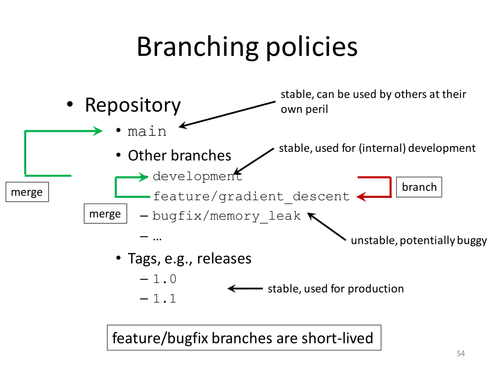

# DAY 2 - GIT/GITHUB : BRANCHES TRAINING - 27/06/2023

## Introduction

The diagram below [^1] illustrates the logic behind branching in GitHub/Git. In this particular example the sequence we followed is **main** $\rightarrow$ **development** $\rightarrow$ **feature**. The latter  constitutes the actual working space.

## Part 1: Preliminaries
- *Create a new repository on the GITHUB website (it just contains a "README" file)*
- *SSH clone to my local computer*
- *On my local computer, edit README file and change one line*
- *Check status ("git status" will show one modified file)*
- *Stage and Commit (git commit -a)*
- *Push to Origin*

## Part 2: Ready to  do some work with branches
- *Start locally a new branch (famous "development" branch) off main*
- *Start locally a new feature branch off development ("feature/hello_world")*
- *I am now inside the feature/hellow_world branch and ready to create a file*
  
    > Create and edit a simple fortran file under the name "hello.f90"
    > 
    > Create a relevant makefile

- *Compile-link the fortran file hello.f90 using the makefile ("make")*
- *Run the executable "hello.exe"*
- *Everything seems to have gone fine, now check the status (git status)*

    > We see three untracked files, ie hello.f90, hello.exe, makefile (and README.md)

- *Create/copy a .gitignore file that ignores executables*
- *Focus on Staging/committing just the .gitignore file*
- *Check status*
- *Out of the blue I decide that my .gitignore file is permanently required on my development branch*
- *Before that, I am pushing my new development branch onto Origin*
  
    > Switch to development
    >
    > Look at all the existing files in this directory (ls -al): There is no .gitignore file
    > 
    > Now push "development" onto Origin (git push origin development)
    
- *Switch back to the "feature/hello_world" branch*
- *Push "feature/hello_world" to Origin (copy this feature branch to website)*
- *Look at the status: There are two untracked files, ie Makefile and hellow_world.f90
- *Focus on stage/commit both Makefile and hellow_world.f90. No problem!*
- *Push to origin the feature/hellow_world branch (git push origin feature/hellow_world)*
- *Go to the GitHub website and set up a Pull-Request (green button!) feature/hw ---> development (feature branch deleted on website!)*
- *Back on the local Linux system, switch to the development brach (git switch development)*
- *Pull the remote development branch towards the local Linux machine (git pull origin development)* 
- *On the local Linux system, create -off the development branch- a new feature branch (feature/bye_world) and, then push it to origin:*  

    > $ git switch -C feature/bye_world
    >
    > $ git push origin feature/bye_world

## Part 3: Continue with branches

- *Look at the status*
    ```bash
mperez2023@DESKTOP-UGTH925:~/GitHub/tmpnew1/branchexercisepart1$ git status
On branch feature/hellow_work
Untracked files:
  (use "git add <file>..." to include in what will be committed)
        Makefile
        hw.f90

nothing added to commit but untracked files present (use "git add" to track)
    ```

[^1]: github.com/gjbex/Version-control-with-git