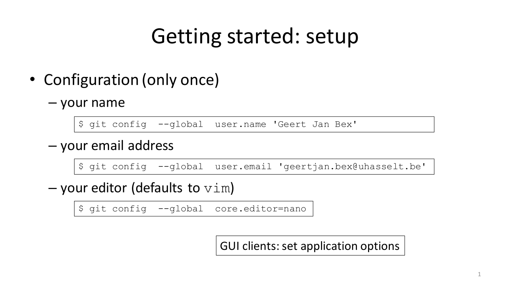

# Corrections to GitHub day 1 exercise (or *The proper way to get started on GitHub via linux*)

## Create a GitHub account and set it up at the website's end, including the upload of an `ssh` publick key

## Set up an SSH agent

In order to be able to communicate with your GitHub website from your local computer and avoid continuously typing your password, an SSH agent would encript your private SSH key. In fact, you need to have the SSH agent running before adding the key. The first step should be making sure you do have the SSH agent running. Otherwise, the SSH agent needs setting up, which takes place by adding a 
`bash` snippet (provided by GJB in my case) to the bottom of your `.profile` (linux) file.

Snippet follows:
 ```bash
SSH_ENV="$HOME/.ssh/agent-environment"

function start_agent {
    echo "Initialising new SSH agent..."
    /usr/bin/ssh-agent | sed 's/^echo/#echo/' > "${SSH_ENV}"
    echo succeeded
    chmod 600 "${SSH_ENV}"
    . "${SSH_ENV}" > /dev/null
#    /usr/bin/ssh-add;
}

# Source SSH settings, if applicable

if [ -f "${SSH_ENV}" ]; then
    . "${SSH_ENV}" > /dev/null
    #ps ${SSH_AGENT_PID} doesn't work under cywgin
    ps -ef | grep ${SSH_AGENT_PID} | grep ssh-agent$ > /dev/null || {
        start_agent;
    }
else
    start_agent;
fi 
 ```

## Configure your GitHub account on your linux local computer (follow the recipe!):

   

   Once you have a `.gitconfig` file on your `$HOME`, it is good practice:
   ```bash
                $cp ~/.gitconfig /etc/gitconfig

                $cp ~/.gitconfig $HOME/.config/git/config
 
                $export XDG_CONFIG_HOME=$HOME/.config
   ```