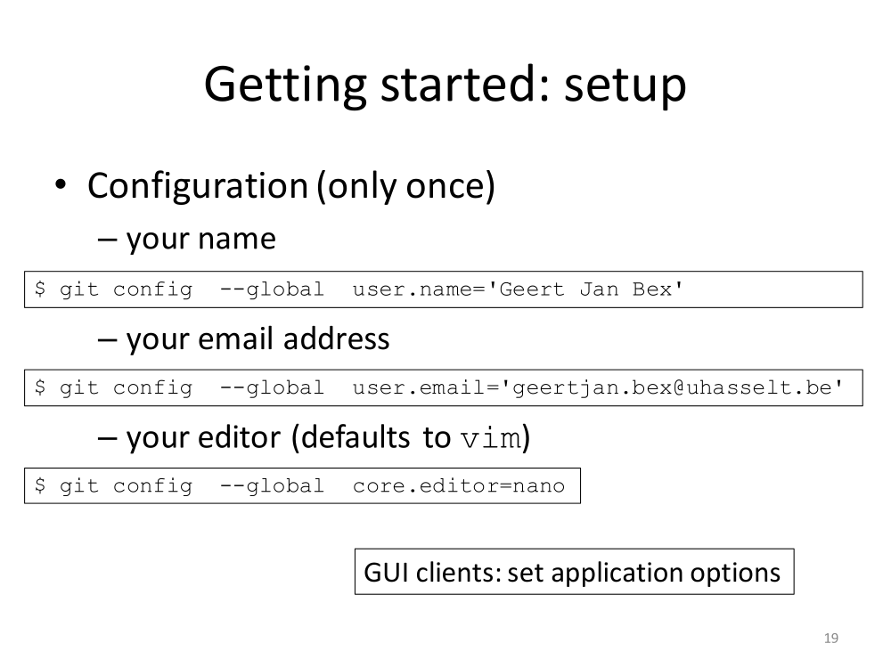

# Some exercises with GitHub (day 1)

## General setup

1. *To start with, GIT's configuration did not work! [^1]*
    [^1]: See correct syntax (git config) in the slide included in contestation
    document "day1contest.md" (the procedure in this document is wrong!).

    

1. *Now add my private key (they all fail! [^2]):*
    [^2]: See contestation document "day1contest.md" for full description of the missing part of this setup: "The SSH Agent" must be running from the outset.
    - First time round (.gitconfig contains official user e-mail [^3]):
      [^3]: manuel.perezjigato@uhasselt.be
       ```bash
          mperez2023@DESKTOP-UGTH925:~$ cd ~/.ssh
          mperez2023@DESKTOP-UGTH925:~/.ssh$ ls
          id_ed25519_github  id_ed25519_github.pub  id_rsa  id_rsa.pub  known_hosts
          mperez2023@DESKTOP-UGTH925:~/.ssh$ ssh-add id_ed25519_github
          Could not open a connection to your authentication agent.
       ```
    - A different private key (.gitconfig contains official user e-mail [^3]):
       ```bash
          mperez2023@DESKTOP-UGTH925:~$ ssh-add ~/.ssh/mperez2023/id_ed25519_github
          Could not open a connection to your authentication agent.
          mperez2023@DESKTOP-UGTH925:~$ ssh-add ~/.ssh/mperez2023/id_rsa
          Could not open a connection to your authentication agent.
       ```
    - Try once more, but changing .gitconfig (to hidden user e-mail [^4]):
      [^4]: 137489281+mperezjigato@users.noreply.github.com
       ```bash
          mperez2023@DESKTOP-UGTH925:~$ ssh-add .ssh/mperez2023/id_ed25519_github
          Could not open a connection to your authentication agent.
          mperez2023@DESKTOP-UGTH925:~$ ssh-add .ssh/mperez2023/id_rsa
          Could not open a connection to your authentication agent.
       ```

## Carry out git/github operations on repository "hello_world" [^5]

   [^5]: Repository "hellow_world" contains the outcome of task2: A collection of computer screenshots documenting the independent steps for an HPC application at VSC (KU Leuven-ICTS).

1. *After creating on the GitHub website a repository named "hello-world", I proceed to cloning it to my local machine [^6].*
   [^6]: Two mistakes were incurred upon: (a) HTTPS instead of SSH, and (b) incorrect website.
    ```bash
          $cd tmp
          $git clone https://github.com/mperezjigato/hello-world
    ```
    with the following outcome:
       ```bash
          Cloning into 'hello-world'...
          remote: Enumerating objects: 43, done.
          remote: Counting objects: 100% (43/43), done.
          remote: Compressing objects: 100% (38/38), done.
          remote: Total 43 (delta 2), reused 0 (delta 0), pack-reused 0
          Receiving objects: 100% (43/43), 8.66 MiB | 2.02 MiB/s, done.
          Resolving deltas: 100% (2/2), done.
       ```
1. *Check for the newly created local directory:*
       ```bash
          mperez2023@DESKTOP-UGTH925:~/GitHub/tmp$ ls
          hello-world
       ```
1. *Enter the new local directory/repository (cd hello-world), and look at its contents (ls -alt), making sure all computer screenshots from task 2 are there*
1. *Print out the full history of my repository (git log):*
       ```bash
          mperez2023@DESKTOP-UGTH925:~/GitHub/tmp/hello-world$ git log
          commit fbf794f767835c8d1b167d33e794424d3b72887e (HEAD -> main, origin/main, origin/HEAD)
          Author: mperezjigato <137489281+mperezjigato@users.noreply.github.com>
          Date:   Mon Jun 26 12:28:01 2023 +0200

          computer screenshots of the HPC application at VSC

          a collection of screeshots and a file containing a website address

          commit b96ac08db223d870426519049fb10d39b97dca5c
          Merge: 0354a51 52e7c0b
          Author: mperezjigato <137489281+mperezjigato@users.noreply.github.com>
          Date:   Mon Jun 26 12:03:39 2023 +0200

          Merge pull request #1 from mperezjigato/readme-edits

          Readme edits

          commit 52e7c0bae3593ca2c4e259aa2bb3c28f52b51971 (origin/readme-edits)
          Author: mperezjigato <137489281+mperezjigato@users.noreply.github.com>
          Date:   Mon Jun 26 11:08:32 2023 +0200

          Update README.md

          I need to introduce myself

          commit 7f215705beb1c55fd19ecc08e327edc7bfc7b0be
          Author: mperezjigato <137489281+mperezjigato@users.noreply.github.com>
          Date:   Mon Jun 26 11:04:34 2023 +0200

          Update README.md

          commit 0354a51ed96019ea5272aff30846adf8112978d3
          Author: mperezjigato <137489281+mperezjigato@users.noreply.github.com>
          Date:   Mon Jun 26 10:11:18 2023 +0200

          Update README.md

          commit e384b48b51f463d262740a2e3901f8779e2f008d
          Author: mperezjigato <137489281+mperezjigato@users.noreply.github.com>
          Date:   Mon Jun 26 10:08:14 2023 +0200

          Initial commit
       ```   
1. Look at the repository configuration in .git/config
       ```bash
          mperez2023@DESKTOP-UGTH925:~/GitHub/tmp/hello-world$ more .git/config
       ```
   with outcome:
       ```bash
          [core]
                repositoryformatversion = 0
                filemode = true
                bare = false
                logallrefupdates = true
          [remote "origin"]
                url = https://github.com/mperezjigato/hello-world
                fetch = +refs/heads/*:refs/remotes/origin/*
          [branch "main"]
                remote = origin
                merge = refs/heads/main
       ```

## Let us work with a second repository that had been previously forked from GJB ("to_remove") to my GutHub web account

1. First clone it to my local computer (same two errors as above [^6]): Type in ubuntu:
       ```bash
          mperez2023@DESKTOP-UGTH925:~$ cd GitHub/
          mperez2023@DESKTOP-UGTH925:~/GitHub$ cd tmp2/
          mperez2023@DESKTOP-UGTH925:~/GitHub/tmp2$ ls
          mperez2023@DESKTOP-UGTH925:~/GitHub/tmp2$ git clone https://github.com/mperezjigato/to_remove
          Cloning into 'to_remove'...
          remote: Enumerating objects: 57, done.
          remote: Counting objects: 100% (57/57), done.
          remote: Compressing objects: 100% (32/32), done.
          remote: Total 57 (delta 25), reused 44 (delta 19), pack-reused 0
          Receiving objects: 100% (57/57), 6.15 KiB | 6.15 MiB/s, done.
          Resolving deltas: 100% (25/25), done.
       ``` 
1. Let us look locally at the newly cloned repository (to_remove)
       ```bash
          mperez2023@DESKTOP-UGTH925:~/GitHub/tmp2$ l s -alt``
          total 12
          drwxr-xr-x 3 mperez2023 mperez2023 4096 Jun 26 13:36 to_remove
          drwxr-xr-x 3 mperez2023 mperez2023 4096 Jun 26 13:36 .
          drwxr-xr-x 6 mperez2023 mperez2023 4096 Jun 26 13:33 ..
          mperez2023@DESKTOP-UGTH925:~/GitHub/tmp2$ cd to_remove/
          mperez2023@DESKTOP-UGTH925:~/GitHub/tmp2/to_remove$ ls -alt
          total 40
          drwxr-xr-x 3 mperez2023 mperez2023 4096 Jun 26 13:36 .
          drwxr-xr-x 8 mperez2023 mperez2023 4096 Jun 26 13:36 .git
          -rw-r--r-- 1 mperez2023 mperez2023   64 Jun 26 13:36 .gitignore
          -rw-r--r-- 1 mperez2023 mperez2023  127 Jun 26 13:36 Makefile
          -rw-r--r-- 1 mperez2023 mperez2023   23 Jun 26 13:36 README.md
          -rw-r--r-- 1 mperez2023 mperez2023   85 Jun 26 13:36 main.c
          -rw-r--r-- 1 mperez2023 mperez2023   86 Jun 26 13:36 to_do.md
          -rw-r--r-- 1 mperez2023 mperez2023  144 Jun 26 13:36 util.c
          -rw-r--r-- 1 mperez2023 mperez2023   77 Jun 26 13:36 util.h
          drwxr-xr-x 3 mperez2023 mperez2023 4096 Jun 26 13:36 ..
       ```
1. Look at its history (git log). In this case, since it had been forked from gjbex, we have: UPSTREAM ---> ORIGIN
       ```bash
          mperez2023@DESKTOP-UGTH925:~/GitHub/tmp2/to_remove$ git log
          commit 9265f4a57224bb164435a8d310686543cbb20eea (HEAD -> main, origin/main, orig                                                                                                                              in/HEAD)
          Merge: f2741dd 2de41cb
          Author: Geert Jan Bex <geertjan.bex@uhasselt.be>
          Date:   Thu Jun 22 15:34:22 2023 +0200

          Merge branch 'main' of github.com:gjbex/to_remove

          commit 2de41cbca6d5179d237ef1fb17f978f0ad3a6e5a
          Author: Geert Jan Bex <geertjan.bex@uhasselt.be>
          Date:   Thu Jun 22 15:30:36 2023 +0200

            Emphasize message

          commit f2741dd8d7157aa4456a63a372ea7bc4d1b6f964
          Author: Geert Jan Bex <geertjan.bex@uhasselt.be>
          Date:   Thu Jun 22 15:29:43 2023 +0200

            Change message format

          commit aafb1450f6b505bcf50dba3d8c37c4b619afbad4
          Merge: 7138a97 0849f28
          Author: Geert Jan Bex <geertjan.bex@uhasselt.be>
          Date:   Thu Jun 22 15:25:13 2023 +0200

          Merge branch 'main' of github.com:gjbex/to_remove

          commit 0849f28873d9f16d5d24271b93dceff95cb9b18a
          Author: Geert Jan Bex <geertjan.bex@uhasselt.be>
          Date:   Thu Jun 22 15:23:07 2023 +0200

            Mark item as done

          commit 7138a97e10d92dd059729d03b858c2e2355fe387
          Author: Geert Jan Bex <geertjan.bex@uhasselt.be>
          Date:   Thu Jun 22 15:22:41 2023 +0200

            Add important to-do item

          commit f0203557a0a270b6411ef159b3af74234fea76b5
          Merge: a290ba0 195acfa
          Author: Geert Jan Bex <gjbex@users.noreply.github.com>
          Date:   Thu Jun 22 15:09:25 2023 +0200

          Merge pull request #1 from gjbex/feature/add_todo

            Feature/add todo

          commit 195acfac5f70775a8f4a6b5769e17614d16ee9d4
          Merge: 6ba8ce7 4eab7bb
          Author: Geert Jan Bex <geertjan.bex@uhasselt.be>
          Date:   Thu Jun 22 14:58:45 2023 +0200

          Merge branch 'main' into feature/add_todo

          commit 6ba8ce79a73b916fba94d6488968cfe40c3a8f1d
          Author: Geert Jan Bex <geertjan.bex@uhasselt.be>
          :...skipping...
          commit 9265f4a57224bb164435a8d310686543cbb20eea (HEAD -> main, origin/main, origin/HEAD)
          Merge: f2741dd 2de41cb
          Author: Geert Jan Bex <geertjan.bex@uhasselt.be>
          Date:   Thu Jun 22 15:34:22 2023 +0200

          Merge branch 'main' of github.com:gjbex/to_remove

          commit 2de41cbca6d5179d237ef1fb17f978f0ad3a6e5a
          Author: Geert Jan Bex <geertjan.bex@uhasselt.be>
          Date:   Thu Jun 22 15:30:36 2023 +0200

            Emphasize message

          commit f2741dd8d7157aa4456a63a372ea7bc4d1b6f964
          Author: Geert Jan Bex <geertjan.bex@uhasselt.be>
          Date:   Thu Jun 22 15:29:43 2023 +0200

            Change message format

          commit aafb1450f6b505bcf50dba3d8c37c4b619afbad4
          Merge: 7138a97 0849f28
          Author: Geert Jan Bex <geertjan.bex@uhasselt.be>
          Date:   Thu Jun 22 15:25:13 2023 +0200

          Merge branch 'main' of github.com:gjbex/to_remove

          commit 0849f28873d9f16d5d24271b93dceff95cb9b18a
          Author: Geert Jan Bex <geertjan.bex@uhasselt.be>
          Date:   Thu Jun 22 15:23:07 2023 +0200

            Mark item as done

          commit 7138a97e10d92dd059729d03b858c2e2355fe387
          Author: Geert Jan Bex <geertjan.bex@uhasselt.be>
          Date:   Thu Jun 22 15:22:41 2023 +0200

            Add important to-do item

          commit f0203557a0a270b6411ef159b3af74234fea76b5
          Merge: a290ba0 195acfa
          Author: Geert Jan Bex <gjbex@users.noreply.github.com>
          Date:   Thu Jun 22 15:09:25 2023 +0200

          Merge pull request #1 from gjbex/feature/add_todo

            Feature/add todo

          commit 195acfac5f70775a8f4a6b5769e17614d16ee9d4
          Merge: 6ba8ce7 4eab7bb
          Author: Geert Jan Bex <geertjan.bex@uhasselt.be>
          Date:   Thu Jun 22 14:58:45 2023 +0200

            Merge branch 'main' into feature/add_todo

          commit 6ba8ce79a73b916fba94d6488968cfe40c3a8f1d
          Author: Geert Jan Bex <geertjan.bex@uhasselt.be>
          Date:   Thu Jun 22 14:54:59 2023 +0200
       ```
1. It is key to look at its .git/config file:
       ```bash
          mperez2023@DESKTOP-UGTH925:~/GitHub/tmp2/to_remove$ more .git/config
          [core]
                  repositoryformatversion = 0
                  filemode = true
                  bare = false
                  logallrefupdates = true
          [remote "origin"]
                  url = https://github.com/mperezjigato/to_remove
                  fetch = +refs/heads/*:refs/remotes/origin/*
          [branch "main"]
                  remote = origin
                  merge = refs/heads/main
       ```
1. Use git status, to check on commits: It is clean!
       ```bash    
          mperez2023@DESKTOP-UGTH925:~/GitHub/tmp2/to_remove$ git status
          On branch main
          Your branch is up to date with 'origin/main'.

          nothing to commit, working tree clean
       ```
1. There is a .gitignore file with the content below:
       ```bash
          mperez2023@DESKTOP-UGTH925:~/GitHub/tmp2/to_remove$ ls -alt
          total 40
          drwxr-xr-x 8 mperez2023 mperez2023 4096 Jun 26 13:54 .git
          drwxr-xr-x 3 mperez2023 mperez2023 4096 Jun 26 13:36 .
          -rw-r--r-- 1 mperez2023 mperez2023   64 Jun 26 13:36 .gitignore
          -rw-r--r-- 1 mperez2023 mperez2023  127 Jun 26 13:36 Makefile
          -rw-r--r-- 1 mperez2023 mperez2023   23 Jun 26 13:36 README.md
          -rw-r--r-- 1 mperez2023 mperez2023   85 Jun 26 13:36 main.c
          -rw-r--r-- 1 mperez2023 mperez2023   86 Jun 26 13:36 to_do.md
          -rw-r--r-- 1 mperez2023 mperez2023  144 Jun 26 13:36 util.c
          -rw-r--r-- 1 mperez2023 mperez2023   77 Jun 26 13:36 util.h
          drwxr-xr-x 3 mperez2023 mperez2023 4096 Jun 26 13:36 ..
          mperez2023@DESKTOP-UGTH925:~/GitHub/tmp2/to_remove$ more .gitignore
          # editor backup files
          *~
          *.swp
          *.bak

          # executables
          a.out
          *.exe
       ```

# We need another .gitignore at the first repository we cloned ("hello_world"): We simply copy this .gitignore (in my local "to_remove" repository) to the other directory

1. Check with git status:
       ```bash
          mperez2023@DESKTOP-UGTH925:~/GitHub/tmp/hello-world$ git status
          On branch main
          Your branch is up to date with 'origin/main'.

          Untracked files:
            (use "git add <file>..." to include in what will be committed)
            .gitignore

          nothing added to commit but untracked files present (use "git add" to track)
       ```
1. Stage and Commit (the latter fails!):
       ```bash
          mperez2023@DESKTOP-UGTH925:~/GitHub/tmp/hello-world$ git add .gitignore
          mperez2023@DESKTOP-UGTH925:~/GitHub/tmp/hello-world$ git commit
          Author identity unknown

          *** Please tell me who you are.

          Run

          git config --global user.email "you@example.com"
          git config --global user.name "Your Name"

          to set your account's default identity.
          Omit --global to set the identity only in this repository.

          fatal: empty ident name (for <mperez2023@DESKTOP-UGTH925.>) not allowed
       ```
1. Check git status:
       ```bash
          mperez2023@DESKTOP-UGTH925:~/GitHub/tmp/hello-world$ git status
          On branch main
          Your branch is up to date with 'origin/main'.

          Changes to be committed:
            (use "git restore --staged <file>..." to unstage)
          new file:   .gitignore
       ```

## Let us configure the account properly now (trial and error!)

1. Type in ubuntu:
       ```bash        
          git config --global user.name "Manuel Perez Jigato"
       ```
   no problem! (do not use the equal sign)
1. Type now:
       ```
          git config --global user.email "manuel.perezjigato@uhasselt.be"
       ```
   no problem! (both seem to work - with and without equal sign -)
1. And the third one:
       ```bash
          git config --global core.editor vim
       ```
   no problem!
1. Look at the resulting config file
       ```bash
          mperez2023@DESKTOP-UGTH925:~$ git config -l
          user.name=Manuel Perez Jigato
          user.email=manuel.perezjigato@uhasselt.be
          core.editor=vim
       ```
   The configuration is saved in a file named .gitconfig at my $HOME directory
   Copy that file (.gitconfig) with a different name to /etc, ie
       ```bash
          cp ~/.gitconfig /etc/gitconfig
       ```
   And you must create a directory git inside $HOME/.config : $HOME/.config/git
   Inside the latter copy the .gitconfig as config
       ```bash
          cp ~/.gitconfig $HOME/.config/git/config
       ``` 
   Finally set up the environment variable XDG_CONFIG_HOME within .bashrc
       ```bash
          export XDG_CONFIG_HOME=$HOME/.config
       ```

## Continue working on hello-world again

1. Look at the GitHub/tmp/hello-world repository: 
modify the README.md file (add a small table at the bottom)
1. Stage the modified file:
       ```bash
          git add README.md
       ```
1. Look at the current commits to be:
       ```bash
          mperez2023@DESKTOP-UGTH925:~/GitHub/tmp/hello-world$ git status
          On branch main
          Your branch is up to date with 'origin/main'.

          Changes to be committed:
            (use "git restore --staged <file>..." to unstage)
          new file:   .gitignore
          modified:   README.md
       ```
1. Now, go for the commit:
       ```bash
          mperez2023@DESKTOP-UGTH925:~/GitHub/tmp/hello-world$ git commit
          [main 2d345ce] File .gitignore copied ; Table added
          2 files changed, 13 insertions(+)
          create mode 100644 .gitignore
       ```
1. Look at git status (CLEAN!):
       ```bash
          mperez2023@DESKTOP-UGTH925:~/GitHub/tmp/hello-world$ git status
          On branch main
          Your branch is ahead of 'origin/main' by 1 commit.
            (use "git push" to publish your local commits)

          nothing to commit, working tree clean
       ```
1. Look at history (git log):
       ```bash
          mperez2023@DESKTOP-UGTH925:~/GitHub/tmp/hello-world$ git log
          commit 2d345ce7585c998499b6beb4884d8175b2cd5e1d (HEAD -> main)
          Author: Manuel Perez Jigato <manuel.perezjigato@uhasselt.be>
          Date:   Mon Jun 26 18:33:20 2023 +0200

          File .gitignore copied ; Table added

          commit fbf794f767835c8d1b167d33e794424d3b72887e (origin/main, origin/HEAD)
          Author: mperezjigato <137489281+mperezjigato@users.noreply.github.com>
          Date:   Mon Jun 26 12:28:01 2023 +0200

          computer screenshots of the HPC application at VSC

          a collection of screeshots and a file containing a website address

          commit b96ac08db223d870426519049fb10d39b97dca5c
          Merge: 0354a51 52e7c0b
          Author: mperezjigato <137489281+mperezjigato@users.noreply.github.com>
          Date:   Mon Jun 26 12:03:39 2023 +0200

          Merge pull request #1 from mperezjigato/readme-edits

          Readme edits

          commit 52e7c0bae3593ca2c4e259aa2bb3c28f52b51971 (origin/readme-edits)
          Author: mperezjigato <137489281+mperezjigato@users.noreply.github.com>
          Date:   Mon Jun 26 11:08:32 2023 +0200

          Update README.md

            I need to introduce myself

          commit 7f215705beb1c55fd19ecc08e327edc7bfc7b0be
          Author: mperezjigato <137489281+mperezjigato@users.noreply.github.com>
          Date:   Mon Jun 26 11:04:34 2023 +0200

          Update README.md

          commit 0354a51ed96019ea5272aff30846adf8112978d3
          Author: mperezjigato <137489281+mperezjigato@users.noreply.github.com>
          Date:   Mon Jun 26 10:11:18 2023 +0200

          Update README.md

          commit e384b48b51f463d262740a2e3901f8779e2f008d
          Author: mperezjigato <137489281+mperezjigato@users.noreply.github.com>
          Date:   Mon Jun 26 10:08:14 2023 +0200

          Initial commit
       ```
1. Go for "git push" (FAILED authentication!):
       ```bash
          mperez2023@DESKTOP-UGTH925:~/GitHub/tmp/hello-world$ git push
          Username for 'https://github.com': mperezjigato
          Password for 'https://mperezjigato@github.com':
          remote: Support for password authentication was removed on August 13, 2021.
          remote: Please see https://docs.github.com/en/get-started/getting-started-with-git/about-remote-repositories#cloning-with-https-urls for information on currently recommended modes of authentication.
          fatal: Authentication failed for 'https://github.com/mperezjigato/hello-world/'
       ```
1. Push having failed, let us see the last commit: git show HEAD
       ```bash
          mperez2023@DESKTOP-UGTH925:~/GitHub/tmp/hello-world$ git show HEAD
          commit 2d345ce7585c998499b6beb4884d8175b2cd5e1d (HEAD -> main)
          Author: Manuel Perez Jigato <manuel.perezjigato@uhasselt.be>
          Date:   Mon Jun 26 18:33:20 2023 +0200

          File .gitignore copied ; Table added

          diff --git a/.gitignore b/.gitignore
          new file mode 100644
          index 0000000..a18d948
          --- /dev/null
          +++ b/.gitignore
          @@ -0,0 +1,8 @@
          +# editor backup files
          +*~
          +*.swp
          +*.bak
          +
          +# executables
          +a.out
          +*.exe
          diff --git a/README.md b/README.md
          index a15c1e2..e86e6a5 100644
          --- a/README.md
          +++ b/README.md
          @@ -14,3 +14,8 @@ I am an intern at the University of Hasselt
           - born in Spain
           - worked as a reserch scientist
           - two children
          +
          +## software interests
          +| vasp | gpaw | abinit | quantum espresso |
          +| ---- | ---- | ------ | ---------------- |
          +| phonons | general | GW | general |
       ```
