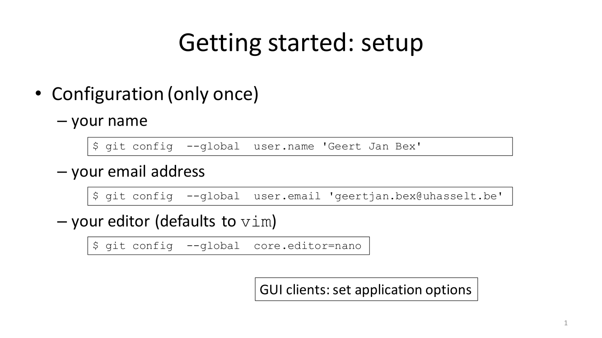
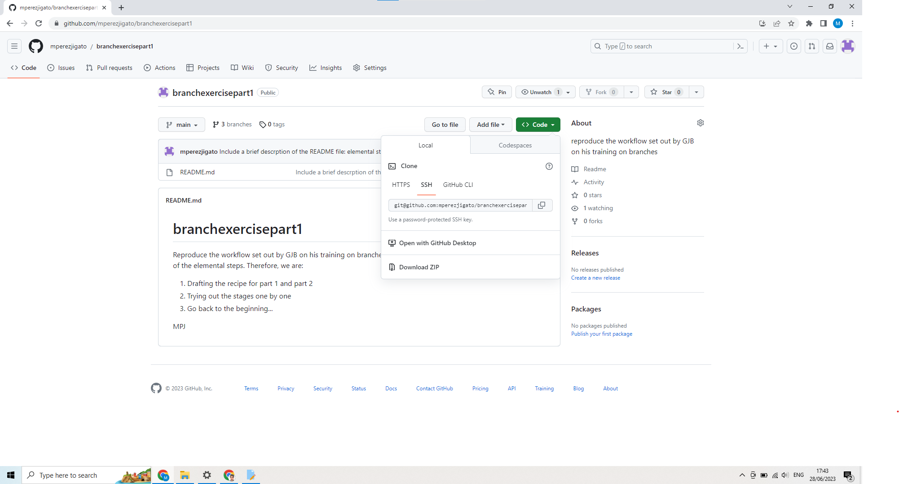

# Corrections to GitHub Day 1 exercises (or *The proper way to get started on GitHub via Linux*)

## Create a GitHub account and set it up at the website's end, including the upload of an `ssh` public key

## Set up an SSH agent

In order to be able to communicate with your GitHub website from your local Linux computer and to avoid having to continuously type your password, an SSH agent is required: It encripts your private SSH key. In fact, the SSH agent must be running before adding the key. The first step after creating and setting up the web account should be making sure the SSH agent is running. Otherwise, the SSH agent needs setting up, which takes place by adding a 
`bash` snippet (provided by GJB in my case) to the bottom of your `.profile` (Linux) file.

Snippet follows:
 ```bash
SSH_ENV="$HOME/.ssh/agent-environment"

function start_agent {
    echo "Initialising new SSH agent..."
    /usr/bin/ssh-agent | sed 's/^echo/#echo/' > "${SSH_ENV}"
    echo succeeded
    chmod 600 "${SSH_ENV}"
    . "${SSH_ENV}" > /dev/null
#    /usr/bin/ssh-add;
}

# Source SSH settings, if applicable

if [ -f "${SSH_ENV}" ]; then
    . "${SSH_ENV}" > /dev/null
    #ps ${SSH_AGENT_PID} doesn't work under cywgin
    ps -ef | grep ${SSH_AGENT_PID} | grep ssh-agent$ > /dev/null || {
        start_agent;
    }
else
    start_agent;
fi 
 ```

## Configure your GitHub account on your Linux local computer (follow the recipe!):

   

   Once you have a `.gitconfig` file on your `$HOME`, it is good practice:
   ```bash
                $cp ~/.gitconfig /etc/gitconfig

                $cp ~/.gitconfig $HOME/.config/git/config
 
                $export XDG_CONFIG_HOME=$HOME/.config
   ```

## A private key needs to be added for communication:
```bash
                $ ssh-add .ssh/authorized_keys/id_rsa_ghmsi
```

## Typically you would like to clone a repository on your local Linux machine:

On your GitHub website, put the cursor on the green button "Code" and choose from the menu the SSH option. Copy next the address provided at the little box, and do
```bash
                     $git clone provided-web-address
```
where "provided-web-address" is the copy-pasted one. Do not use as address the website corresponding to the repository (see picture below):

